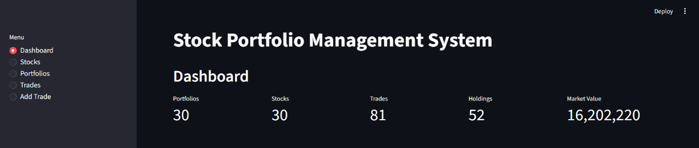
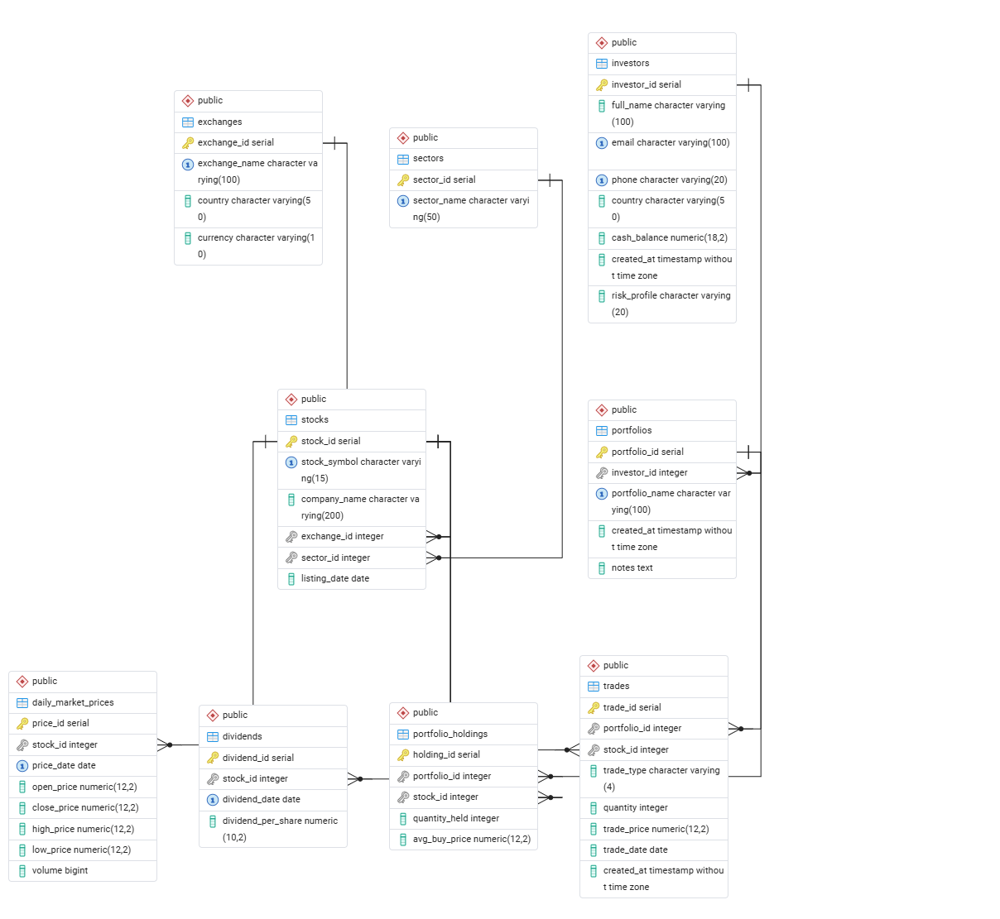
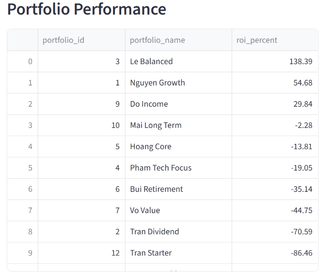
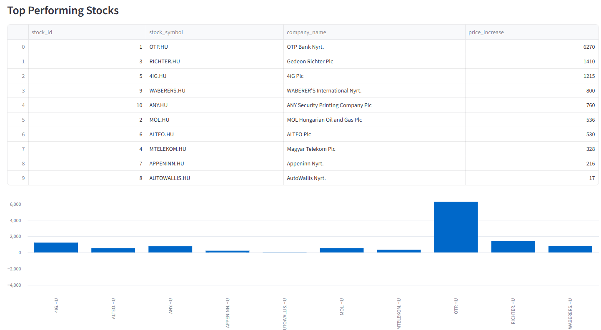
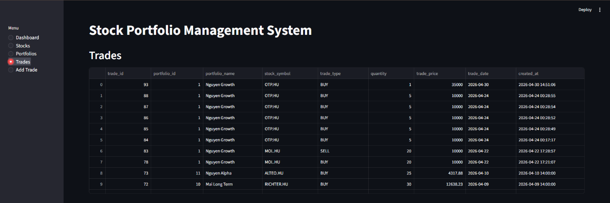
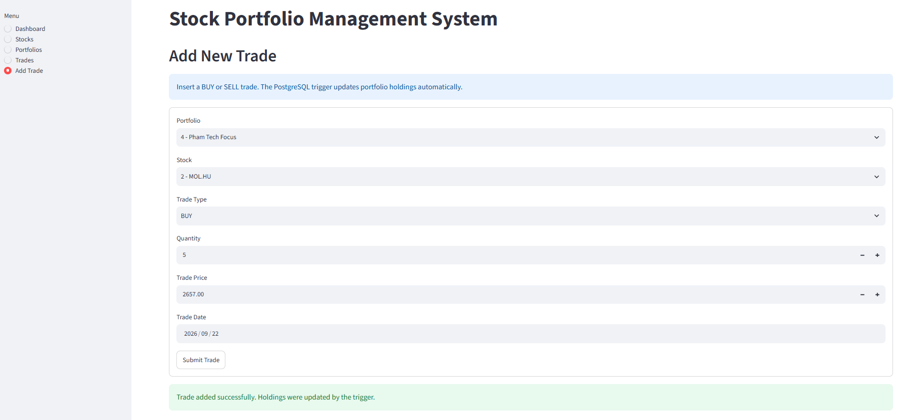

# Stock Portfolio & Market Analytics Database

A normalized PostgreSQL database for tracking investors, portfolios, trades, holdings, and stock
market prices, with automated portfolio updates and a Streamlit front end for exploring the data.

Built as a database-design project: the focus is the schema, constraints, functions, triggers,
views, and indexing — the front end exists to demonstrate that the database supports a real
application.



## Overview

- **9 tables**, normalized to Third Normal Form (3NF), covering market data (exchanges, sectors,
  stocks), time-series data (daily prices, dividends), client/wealth management (investors,
  portfolios, holdings), and transaction history (trades).
- **9 foreign keys** and **21 CHECK constraints** enforcing referential and financial integrity
  (e.g. cash balance can't go negative, candlestick prices must be internally consistent).
- **2 PL/pgSQL functions** (`portfolio_roi`, `portfolio_total_value`) for portfolio-level
  analytics.
- **1 trigger** (`trg_update_holdings`) that keeps `portfolio_holdings` in sync automatically
  whenever a trade is inserted, and rejects a SELL that exceeds the current holding.
- **2 views** (`top_performing_stocks`, `portfolio_performance`) and **1 materialized view**
  (`latest_market_prices`) for reporting.
- **6 targeted indexes**, benchmarked with `EXPLAIN ANALYZE` at a scaled-up 1M-row size — see
  [Indexing & Performance](#indexing--performance) below.
- A **Streamlit + psycopg2** front end (dashboard, stock list, portfolio holdings, trade history,
  add-trade form) that reads from the tables/views and writes through the trigger.

## Entity-Relationship Diagram



| Group | Tables |
|---|---|
| Market data | `exchanges`, `sectors`, `stocks` |
| Time-series data | `daily_market_prices`, `dividends` |
| Client & wealth management | `investors`, `portfolios`, `portfolio_holdings` |
| Transaction history | `trades` |

`trades` (history) and `portfolio_holdings` (current state) are kept separate so the ledger can
grow without bloating the table used for live portfolio value.

## Indexing & Performance

The project database only holds 300 price rows and 80 trades, too small for an index to show a
measurable effect. To validate the indexing choices properly, `database/index_benchmark.sql`
scales a scratch copy of the database to **~1M rows** (20,000 stocks, ~1M prices, ~1M trades) and
compares `EXPLAIN ANALYZE` with and without each index.

| Query | Without index (seq scan) | With index | Speed-up |
|---|---|---|---|
| Trades filtered by date (`idx_trade_date`) | ~99 ms | ~2 ms | **~50x** |

Four of the originally-named indexes (`idx_stock_symbol`, `idx_price_stock_id`,
`idx_daily_market_prices_stock_date`, `idx_portfolio_holdings_portfolio_stock`) turned out to
duplicate indexes already created by `UNIQUE` constraints, so they add no measurable benefit —
`idx_trade_date` is the one index doing real work. This is documented in the benchmark script
rather than hidden, since it's a useful finding in its own right.

Run it yourself:
```bash
createdb bench
pg_restore -d bench database/stock_market.backup   # or run database/schema.sql for schema only
psql -d bench -f database/index_benchmark.sql
```
Run each `EXPLAIN ANALYZE` a few times and take the median — the first run is slower due to a
cold cache. **Only run this against a scratch database**: it inserts ~2 million synthetic rows.

## Tech Stack

| Layer | Technology |
|---|---|
| Database | PostgreSQL |
| Backend / scripting | Python, psycopg2, pandas |
| Front end | Streamlit |
| Config | python-dotenv (`.env` file, not committed) |

## Running the Front End

```bash
git clone https://github.com/Tusnguyen1612/Stock-Portfolio-Market-Analytics-Project.git
cd Stock-Portfolio-Market-Analytics-Project

python -m venv venv && source venv/bin/activate   # Windows: venv\Scripts\activate
pip install -r requirements.txt

# create a .env file:
#   DB_HOST=localhost
#   DB_PORT=5432
#   DB_NAME=stock_portfolio
#   DB_USER=postgres
#   DB_PASSWORD=your_password

# restore the database (or run database/schema.sql for an empty schema)
createdb stock_portfolio
pg_restore -d stock_portfolio database/mid_project_final.backup

streamlit run app.py
```
Then open `http://localhost:8501`.

## Front-End Pages

| Page | What it shows |
|---|---|
| Dashboard | Portfolio/stock/trade/holding counts and total market value |
| Stocks | Stock list joined with the `latest_market_prices` materialized view |
| Portfolios | Per-investor portfolio list |
| Holdings | Current holdings and market value for a selected portfolio (`portfolio_performance` view) |
| Trades | Full trade history |
| Add Trade | Inserts a BUY/SELL trade; the `trg_update_holdings` trigger updates holdings automatically |

### Portfolio Performance
Shows ROI for each portfolio, calculated by the `portfolio_performance` view.



### Top Performing Stocks
Ranks stocks by price increase, from the `top_performing_stocks` view.



### Trade history
Full transaction history, joined with portfolio and stock names.



### Add Trade
Inserts a BUY/SELL trade. The `trg_update_holdings` trigger updates `portfolio_holdings` automatically.



All six front-end test cases (page loads, trade submission, trigger-driven holdings update) passed
during testing.

## License

MIT — feel free to reuse the schema or benchmark approach.
